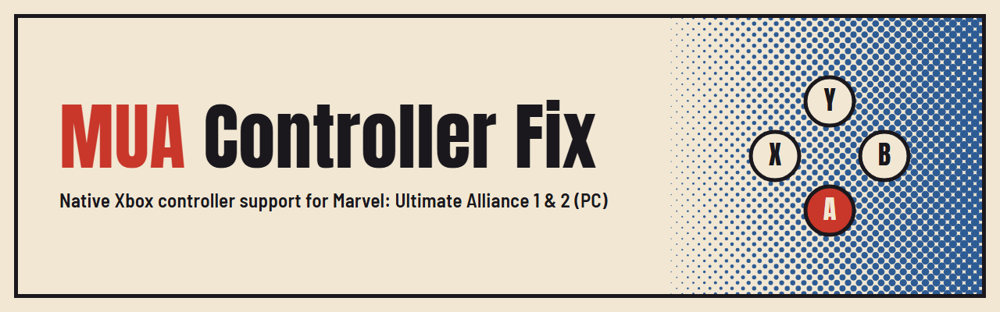
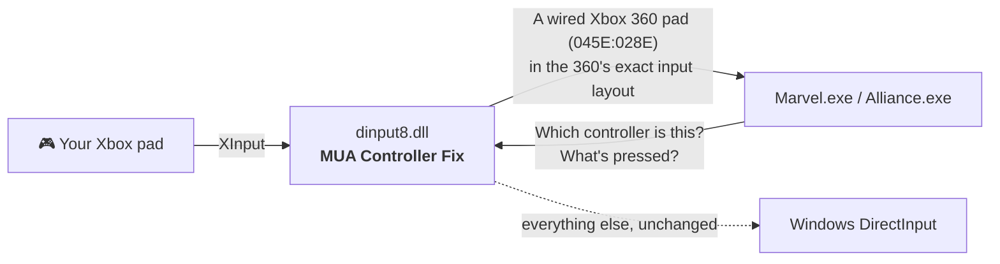

<p align="center">
  
</p>

<p align="center">
  <a href="https://github.com/ChronoRixun/mua-controller-fix/releases/latest"></a>
  <a href="https://github.com/ChronoRixun/mua-controller-fix/actions/workflows/build.yml"></a>
  
  <a href="LICENSE"></a>
</p>

<p align="center">
  <b>Drop in one file. Every button matches its prompt.</b>
</p>

---

Playing **Marvel: Ultimate Alliance** or **Marvel: Ultimate Alliance 2** on PC with a modern Xbox controller? You've probably met this: the game says *press A*, and A does the wrong thing, so you have to press **X**. The prompts, the menus and your muscle memory all disagree.

**MUA Controller Fix** makes your controller work the way the game was designed for: every button does what its on-screen prompt says, in the menus and in combat.

|                     | Without the fix | With the fix |
| ------------------- | --------------- | ------------ |
| Prompt says **A**   | you have to press **X** | press **A** |
| On-screen button icons | don't match your pad | match your pad |
| Setup               | remapping tools or community Steam Input configs | copy one file |

## ⚡ Install

1. **[Download the latest release](https://github.com/ChronoRixun/mua-controller-fix/releases/latest)** and unzip it.
2. Copy **`dinput8.dll`** into the game folder, the one that contains the game's `.exe`:

   | Game | Folder (Steam default) | Executable |
   | ---- | ---------------------- | ---------- |
   | Marvel: Ultimate Alliance | `…\steamapps\common\Marvel - Ultimate Alliance` | `Marvel.exe` |
   | Marvel: Ultimate Alliance 2 | `…\steamapps\common\Marvel - Ultimate Alliance 2` | `Alliance.exe` |

   > **Tip:** in Steam, right-click the game → **Manage** → **Browse local files**.
3. Play. That's it.

**Uninstall:** delete `dinput8.dll` from the game folder.

## 🎮 Compatibility

**Games:** the 2016 PC releases of *Marvel: Ultimate Alliance* and *Marvel: Ultimate Alliance 2*: the 64-bit versions that were sold on Steam. (The 2006 PC release of the first game is a different, 32-bit program and isn't supported.)

**Controllers:**

| Controller | Status |
| ---------- | ------ |
| Xbox Wireless Controller (Series X\|S) over Bluetooth | ✅ Tested, both games |
| Other Xbox One / Series pads, USB or Bluetooth | 🟢 Expected to work: they use the same XInput path |
| Third-party XInput pads | 🟢 Expected to work |
| Pads the games already recognise (wired/wireless Xbox 360, original Xbox One pad) | Left untouched: they already work |
| PlayStation / Switch controllers | Only through a tool that presents them as an Xbox pad (e.g. Steam Input or DS4Windows); untested |

Tried a controller that isn't listed? Please [open an issue](https://github.com/ChronoRixun/mua-controller-fix/issues) and say how it went.

## 🔍 What was actually wrong

The 2016 ports read gamepads through DirectInput. To decide which physical button means "A", they look up your controller's USB product ID in a small built-in table:

| Product ID | Controller |
| ---------- | ---------- |
| `045E:028E` | Xbox 360 Controller (wired) |
| `045E:02A1` | Xbox 360 Wireless Controller |
| `045E:02D1` | Xbox One Controller (original model) |
| `045E:02FF` | Xbox One Controller (XInput-HID) |
| `054C:05C4` | DualShock 4 |
| `28DE:11FF` | Steam virtual gamepad |
| + a few generic USB adapters | |

Controllers released since then aren't in that table. An Xbox Wireless Controller over Bluetooth, for example, reports `045E:0B22`, so the game falls back to a **generic layout** that assumes a different button order, and the face buttons come out scrambled. People reported this on the Steam forums as far back as 2016.

## 🛠️ How the fix works

`dinput8.dll` sits in the game folder, where Windows loads it in place of its own copy. It forwards everything to the real DirectInput and changes just two things for Xbox-compatible pads the game doesn't recognise:

1. **Identity.** It reports the pad as a wired Xbox 360 controller (`045E:028E`), a model the games handle correctly, so they pick the right layout and button icons.
2. **Input.** It builds the pad's DirectInput state from XInput in exactly the layout a wired Xbox 360 pad reports: buttons, D-pad, sticks (respecting the game's own deadzones) and the shared trigger axis. How your particular pad describes itself over USB or Bluetooth stops mattering.



It doesn't touch Steam, your saves, online play or any game files, and it doesn't need an installer. Remove the DLL and the game is exactly as it was.

## 🧰 Troubleshooting

- **Nothing changed?** Make sure `dinput8.dll` is in the same folder as `Marvel.exe` / `Alliance.exe`, not a subfolder.
- **Every launch writes `mua-controller-fix.log`** next to the DLL. It lists the controllers the game saw and what the fix did. Attach it to any bug report.
- **Already using another mod called `dinput8.dll`** (e.g. an ASI loader)? Only one file can have that name, so the two will conflict. Open an issue and we'll look at a compatible option.
- **Using Steam Input for the game** and buttons are still off? Try turning Steam Input off for the game (**Properties → Controller**), so the game sees your pad directly.

## 🏗️ Building from source

Requires Visual Studio 2022 with the C++ workload (which includes CMake).

```powershell
cmake -S . -B build -A x64
cmake --build build --config Release
build\bin\Release\fix_test.exe          # add --live to watch your pad as the game sees it
```

The output is `build\bin\Release\dinput8.dll`. `fix_test.exe` loads it exactly the way the game does and checks the forwarding and, with a controller connected, the presented identity and input layout through both DirectInput interfaces. Release builds are produced by [GitHub Actions](.github/workflows/build.yml) from tagged source.

## 📜 License & disclaimer

[MIT](LICENSE). Use it, share it, build on it.

This is an unofficial fan fix. It is not affiliated with or endorsed by Activision, Marvel, Disney or Microsoft. It contains no game files or game code; you need your own copy of the game.
