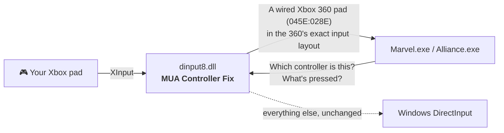

<p align="center">
  
</p>

<p align="center">
  <a href="https://github.com/ChronoRixun/mua-controller-fix/releases/latest"></a>
  <a href="https://github.com/ChronoRixun/mua-controller-fix/actions/workflows/build.yml"></a>
  
  <a href="LICENSE"></a>
</p>

<p align="center">
  <b>Drop in one file. Every button matches its prompt.</b>
</p>

---

Playing **Marvel: Ultimate Alliance** or **Marvel: Ultimate Alliance 2** on PC with a modern Xbox controller? You've probably met this: the game says *press A*, and A does the wrong thing, so you have to press **X**. The prompts, the menus and your muscle memory all disagree.

**MUA Controller Fix** makes your controller work the way the game was designed for: every button does what its on-screen prompt says, in the menus and in combat.

|                     | Without the fix | With the fix |
| ------------------- | --------------- | ------------ |
| Prompt says **A**   | you have to press **X** | press **A** |
| On-screen button icons | don't match your pad | match your pad |
| Setup               | remapping tools or community Steam Input configs | copy one file |

It also shows what you're playing on **Discord**: the area and your hero, taken from the game itself ([details](#-discord)). And it loads mods (costumes, models, textures, data, movies) from a `mods` folder, leaving the game's own files alone ([details](#-mods)).

## ⚡ Install

1. **[Download the latest release](https://github.com/ChronoRixun/mua-controller-fix/releases/latest)** and unzip it.
2. Copy **`dinput8.dll`** into the game folder, the one that contains the game's `.exe`:

   | Game | Folder (Steam default) | Executable |
   | ---- | ---------------------- | ---------- |
   | Marvel: Ultimate Alliance | `…\steamapps\common\Marvel - Ultimate Alliance` | `Marvel.exe` |
   | Marvel: Ultimate Alliance 2 | `…\steamapps\common\Marvel - Ultimate Alliance 2` | `Alliance.exe` |

   > **Tip:** in Steam, right-click the game → **Manage** → **Browse local files**.
3. Play. That's it.

**Uninstall:** delete `dinput8.dll` from the game folder. Mods in a [`mods` folder](#-mods) stop loading with it.

## 🎮 Compatibility

**Games:** the 2016 PC releases of *Marvel: Ultimate Alliance* and *Marvel: Ultimate Alliance 2*: the 64-bit versions that were sold on Steam. (The 2006 PC release of the first game is a different, 32-bit program and isn't supported.)

**Controllers:**

| Controller | Status |
| ---------- | ------ |
| Xbox Wireless Controller (Series X\|S) over Bluetooth | ✅ Tested, both games |
| Other Xbox One / Series pads, USB or Bluetooth | 🟢 Expected to work: they use the same XInput path |
| Third-party XInput pads | 🟢 Expected to work |
| Pads the games already recognise (wired/wireless Xbox 360, original Xbox One pad) | Left untouched: they already work |
| PlayStation / Switch controllers | Only through a tool that presents them as an Xbox pad (e.g. Steam Input or DS4Windows); untested |

Tried a controller that isn't listed? Please [open an issue](https://github.com/ChronoRixun/mua-controller-fix/issues) and say how it went.

## 🔍 What was actually wrong

The 2016 ports read gamepads through DirectInput. To decide which physical button means "A", they look up your controller's USB product ID in a small built-in table:

| Product ID | Controller |
| ---------- | ---------- |
| `045E:028E` | Xbox 360 Controller (wired) |
| `045E:02A1` | Xbox 360 Wireless Controller |
| `045E:02D1` | Xbox One Controller (original model) |
| `045E:02FF` | Xbox One Controller (XInput-HID) |
| `054C:05C4` | DualShock 4 |
| `28DE:11FF` | Steam virtual gamepad |
| + a few generic USB adapters | |

Controllers released since then aren't in that table. An Xbox Wireless Controller over Bluetooth, for example, reports `045E:0B22`, so the game falls back to a **generic layout** that assumes a different button order, and the face buttons come out scrambled. People reported this on the Steam forums as far back as 2016.

## 🛠️ How the fix works

`dinput8.dll` sits in the game folder, where Windows loads it in place of its own copy. It forwards everything to the real DirectInput and changes just two things for Xbox-compatible pads the game doesn't recognise:

1. **Identity.** It reports the pad as a wired Xbox 360 controller (`045E:028E`), a model the games handle correctly, so they pick the right layout and button icons.
2. **Input.** It builds the pad's DirectInput state from XInput in exactly the layout a wired Xbox 360 pad reports: buttons, D-pad, sticks (respecting the game's own deadzones) and the shared trigger axis. How your particular pad describes itself over USB or Bluetooth stops mattering.



It doesn't change your saves, online play or any game files, and it doesn't need an installer. Remove the DLL and the game is exactly as it was.

## 💬 Discord

On by default. With the Discord app running on the same PC, your Discord profile shows what you're doing in the game while it runs, with the game's picture and the time played:

| In the game | Discord shows |
| ----------- | ------------- |
| Starting up | the game's name and the time |
| Main menu | **In the Main Menu** |
| A mission or a hub | **Latveria: Urban Warfare**<br>Playing as Wolverine |

**Where the text comes from:** both games already write a status line for Steam's friends list ("Playing *area* As *hero*"). The fix reads that line as the game hands it to Steam, passes the call on unchanged, and shows the same text on Discord. A few of MUA1's short names are spelled out (*Stark* → *Stark Tower*, *Moonknight* → *Moon Knight*). In co-op it shows player 1's hero. (The games write the line once for each of the four player slots, so on Steam an empty slot's "Watching someone else play." always wins. Discord gets player 1's.)

An update goes out at most every 5 seconds (Discord allows about five in 20 seconds), and quitting the game clears it. Discord not running? The fix looks for it every 20 seconds, quietly, and connects once it starts.

**What's shared:** only that text (the area and player 1's hero) and the time since the game started. No player names, no PC, network or account details, and nothing about online lobbies. It goes to the Discord app on your own PC through its local pipe, and Discord shows it to whoever Discord shows your activity to (*User Settings → Activity Privacy* decides who).

**Settings** go in `mua-controller-fix.ini`, next to `dinput8.dll` (create it). Every key is optional:

```ini
[Discord]
Enabled=1      ; 0: no Discord presence at all
ShowZone=1     ; 0: hide the area
ShowHero=1     ; 0: hide the hero
LargeImage=    ; none: no picture (empty: the game's I / II)
ClientId=      ; another Discord application's id, for testing
```

The pictures are the project's own art ([docs/discord-art](docs/discord-art)): no game or publisher artwork.

## 📦 Mods

Mods replace some of the game's files: a costume, a hero's stats, a fight style, a movie. With the fix, each mod goes in a folder of its own under `mods`, laid out like the game folder. The game's own files stay as they are, and switching a mod off is one line:

```
Marvel - Ultimate Alliance\
  Marvel.exe
  dinput8.dll
  mods\
    load-order.txt
    Classic Wolverine\
      actors\0301.igb
    Faster Combat\
      data\fightstyles\fightstyle_default.engb
```

When the game opens a file for reading, the fix looks in the mods first: a mod's file with the same path wins over the game's. `mods\load-order.txt` decides which mod wins when two have the same file (the later line wins) and which are on:

```
# lowest priority first; later lines win
+Classic Wolverine
# "-" keeps a mod in its place but switched off
-Faster Combat
```

A folder that isn't listed loads after the listed ones, in alphabetical order, switched on; folders whose names start with `.` are skipped, and so are a mod's own `mod.json`, `readme.txt` and `readme.md` at its top level. The file is UTF-8 (a byte order mark is fine). The [Ultimate Legends launcher](https://github.com/ChronoRixun/ultimate-legends) has a Mods section that adds mods from a `.zip` or a folder, switches them on and off and changes the order, in this same file.

The mods are read once, when the game starts: add or change one, then restart the game. A file that exists only in a mod is found when the game asks for it by name, but it doesn't show up when the game lists a folder's contents. Saves and settings are written where they always are.

### What a mod can replace

Any file the game loads: models and costumes, textures, maps, animations, data (stats, powers, fight styles, missions, text), menus, packages, movies and sounds. Most of them live in the game's encrypted `.bin` archives (`actors.bin`, `textures.bin`, `data.bin`, …), and a mod gives its file the path the game uses for it, the archive's name first: the `1501.igz` in MUA2's `actors.bin` is `actors\1501.igz` in a mod. To see those names, add this to `mua-controller-fix.ini`; the log then lists every file the game looks for, in its archives or not (a long log; leave it off for play):

```ini
[Debug]
LogFiles=1
```

```
files: from the archives: actors/0301.igb
files: from the archives: textures/fonts/ng_pc_big_fhd.igb
```

Tested in both games with files from the games' own archives:

|       | Marvel: Ultimate Alliance | Marvel: Ultimate Alliance 2 |
| ----- | ------------------------- | --------------------------- |
| Model | the title screen's ALLIANCE wordmark (`ui\models\m_logo_alliance.igb`) replaced by the ULTIMATE one | Iron Man's armour (`actors\1501.igz`) replaced by his New Avenger armour, in a level |
| Data  | `data\RichPresence.engb`: the game's status line on Steam changed | `data\richpresence.xmlb`: the level's name changed in the status line ("Playing Latveria: Modded Warfare As Iron Man.") |
| Movie | the Activision logo replaced by another movie | the same |

**How it works.** The fix hooks the game's file lookups for reading (`CreateFile`, `GetFileAttributes`, `FindFirstFile` and the C runtime's `fopen` / `fopen_s`) in the game's `.exe` and in Bink and FMOD, which open movies and sounds, and hands the game a mod's copy of a file it asks for. Writes are never redirected. Most files, though, the game never asks Windows for: before it opens a file it looks for it in its `.bin` archives, and reads it from there when it's found. For a file a mod has, the fix makes that lookup come back empty, so the game opens the file from disk and gets the mod's copy; every other file is looked up as before. That is a change to the game's code, one call, made only after every byte it relies on matches the retail Steam build (on the Steam release, once Steam's own decryption of the code has run). On any other build the archives are left alone, mods still replace the files the game reads from disk (data and menus in MUA, packages, movies and sounds in both), and `mua-controller-fix.log` says why. With no files under `mods`, nothing is hooked or changed. The log lists each file a mod replaces, once (`mods: fopen actors/0301.igb -> …\mods\Classic Wolverine\actors\0301.igb`).

## 🧰 Troubleshooting

- **Nothing changed?** Make sure `dinput8.dll` is in the same folder as `Marvel.exe` / `Alliance.exe`, not a subfolder.
- **Every launch writes `mua-controller-fix.log`** next to the DLL. It lists the controllers the game saw and what the fix did. Attach it to any bug report.
- **Already using another mod called `dinput8.dll`** (e.g. an ASI loader)? Only one file can have that name, so the two will conflict. Open an issue and we'll look at a compatible option.
- **Using Steam Input for the game** and buttons are still off? Try turning Steam Input off for the game (**Properties → Controller**), so the game sees your pad directly.
- **Nothing on Discord?** The Discord desktop app has to be running on the same PC, with **User Settings → Activity Privacy → Share your detected activities with others** switched on. The log's `discord:` lines say whether the fix connected (`discord: connected as Marvel: Ultimate Alliance 2`) and what it sent (`discord: presence -> …`).
- **A mod does nothing?** Its folder goes in `mods` next to the game's `.exe`, with the game's own folder names inside (`mods\My Mod\data\…`, not `mods\My Mod\My Mod\data\…`). The log's `mods: My Mod - 3 file(s)` line says the fix found it, and a `mods: … -> …` line appears for each of its files the game used. A file with no such line is one the game never asked for under that name: with `[Debug] LogFiles=1` the log lists the names the game uses (`files: from the archives: …`), and a mod's file needs one of them.

## 🏗️ Building from source

Requires Visual Studio 2022 with the C++ workload (which includes CMake).

```powershell
cmake -S . -B build -A x64
cmake --build build --config Release
build\bin\Release\fix_test.exe          # add --live to watch your pad as the game sees it
```

The output is `build\bin\Release\dinput8.dll`. `fix_test.exe` loads it exactly the way the game does and checks the forwarding and, with a controller connected, the presented identity and input layout through both DirectInput interfaces. It also checks the Discord presence's rules (how status lines are worded, what's sent to Discord) and the mod loader: the load order, and which files a copy of itself, set up like a game folder with mods, gets when it reads and writes. Release builds are produced by [GitHub Actions](.github/workflows/build.yml) from tagged source.

## 📜 License & disclaimer

[MIT](LICENSE). Use it, share it, build on it.

This is an unofficial fan fix. It is not affiliated with or endorsed by Activision, Marvel, Disney, Microsoft or Discord. It contains no game files or game code; you need your own copy of the game.
